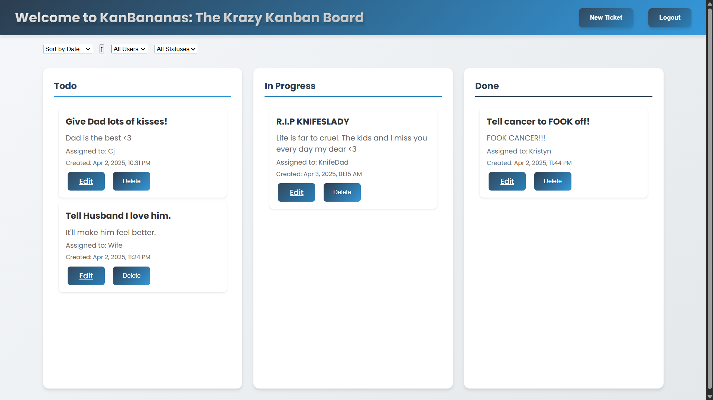

# 🍌 KanBananas 🍌

A fun and functional Kanban board application that helps you organize your tasks with a tropical twist! Built with React, TypeScript, and a sprinkle of banana magic.

## 🌐 Live Demo

Try out KanBananas right now! Visit our live deployment:
- Frontend: [https://kanbananas-frontend.onrender.com/](https://kanbananas-frontend.onrender.com/)



## 🌟 Features

- **Drag-and-Drop Task Management**: Move tasks between columns with ease
- **User Authentication**: Secure login system with JWT
- **Task Organization**: Create, edit, and delete tasks
- **Smart Filtering**: Filter tasks by user and status
- **Sorting Options**: Sort tasks by name, date, or status
- **Responsive Design**: Works beautifully on desktop and mobile
- **Modern UI**: Clean interface with smooth animations

## 🛠️ Tech Stack

- **Frontend**: React, TypeScript, CSS3
- **Backend**: Node.js, Express
- **Database**: PostgreSQL
- **Authentication**: JWT
- **Styling**: Custom CSS with modern gradients and animations

## 🚀 Getting Started

### Prerequisites

- Node.js (v14 or higher)
- PostgreSQL
- npm

### Installation

1. Clone the repository:
```bash
git clone https://github.com/yourusername/KanBananas.git
cd KanBananas
```

2. Install dependencies:
```bash
# Install server dependencies
cd server
npm install

# Install client dependencies
cd ../client
npm install
```

3. Set up environment variables:
   - Create `.env` files in both `server` and `client` directories
   - Copy the example environment variables and fill in your values

4. Start the development servers:
```bash
# Start the server (from server directory)
npm run dev

# Start the client (from client directory)
npm start
```

## 📝 Usage

1. Create an account or log in
2. Create new tasks using the "New Ticket" button
3. Drag tasks between columns to update their status
4. Use filters and sorting options to organize your tasks
5. Edit or delete tasks as needed

## 🤝 Contributing

Contributions are welcome! Please feel free to submit a Pull Request.

## 📄 License

This project is licensed under the MIT License - see the [LICENSE](LICENSE) file for details.

## 🙏 Acknowledgments

- Special thanks to edX Bootcamps for providing the starter code that helped make this project possible
- Inspired by the need for a more fun and engaging task management solution
- Built with 🍌 and ❤️

## 📞 Support

Have questions or suggestions? Open an issue or reach out to the maintainers!

## 👥 Meet the Team

### The Dynamic Duo 🦸‍♂️🦸‍♀️

We're not just developers, we're BFFs who turned our coding sessions into a tropical task management paradise! When we're not pair-programming and finishing each other's code (and sentences), we're probably debating whether bananas belong on pizza (they do, fight us!).

#### Guy Ricketts (KnifeDad) 🍳
- The mastermind behind the banana magic
- Known for his sharp wit and even sharper code
- When not coding, he's probably thinking about coding
- [GitHub](https://github.com/KnifeDad)

#### Muhsina Shinwari 🌟
- The queen of task management and verbal Jiu-Jitsu
- Turns coffee into code (and occasionally into more coffee)
- Has a secret talent for finding bugs before they happen
- [GitHub](https://github.com/Muhsina-de)

Together, we're like a well-oiled machine, except we run on coffee, code, and dad jokes. Our pair-programming sessions are legendary - we're so in sync, we sometimes forget which one of us wrote which line of code!

---

Made with 🍌 by KnifeDad and Muhsina 